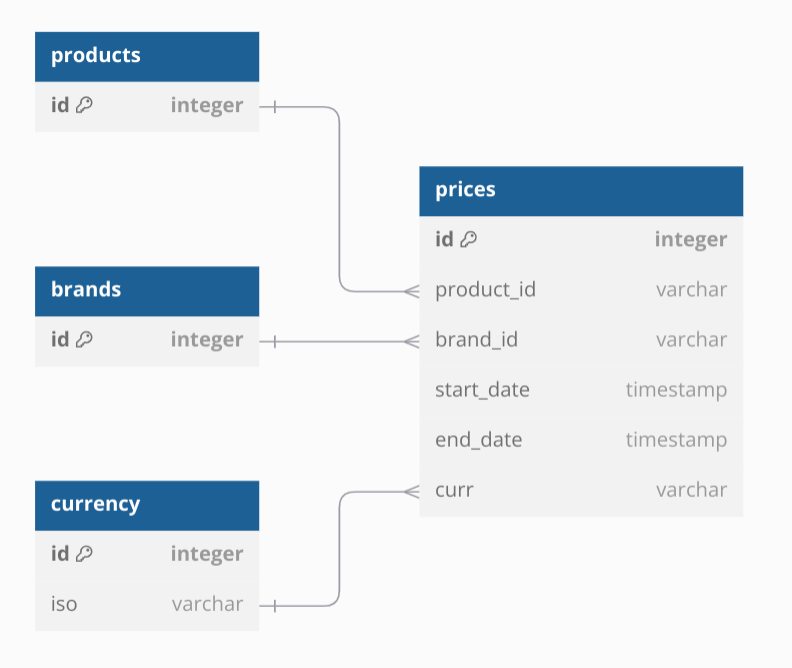

# Proyecto Spring Boot con Maven

## Descripción
Este proyecto es una aplicación web construida con Spring Boot y Maven. 
La aplicación es un servicio REST que permite consultar precios de productos en una base de datos H2.

## Base de datos local

La aplicación utiliza una base de datos H2 en memoria. 
Al iniciar la aplicación, se cargan los datos de prueba en la base de datos.

## Requisitos

- Java 21
- Maven 3.9.9

## Estructura del Proyecto

- `src/main/java`: Código fuente de la aplicación
- `src/main/resources`: Archivos de configuración y recursos estáticos
- `src/test/java`: Pruebas unitarias y de integración

## Modelado del problema
- A analizar el enunciado pude obtener las siguientes entidades:
  - `Brand`: Marca de un producto
  - `Product`: Producto
  - `Price`: Precio de un producto en una fecha determinada.
    
- Sin embargo, opte por modelar las entidades `Price` y `Brand` en la [base de datos](prices/src/main/resources/schema.sql), ya que no encontré una clave foreanea para `Product`

## Estructura
- Utilice una estructura de paquetes basada en la arquitectura hexagonal. Separando en tres capas:
  - `application`: Lógica de aplicación
  - `domain`: Entidades y lógica de dominio
  - `infrastructure`: Implementación de la lógica de aplicación

## Abstracciones
- Para abstraer la lógica de aplicación de la implementación, se utilizaron interfaces. Siguiendo el principio de inversión de dependencias. Esto permite en un futuro cambiar la implementación sin modificar la lógica de aplicación.
  
## Dockerización

El proyecto está dockerizado con una imagen multistage, para evitar el código fuente acabe en el contenedor de producción y así aligerar la imagen.

## Tests
- Para poder realizar tests unitarios y de integración, se utilizó JUnit Jupyter y Mockito. 
- Para poder realizar tests de integración, se utilizó la base de datos H2 en memoria y MockMvc.
- No se separó la ejecución de los tests unitarios y de integración en diferentes fases de Maven, ya que al momento no lo note necesario.

## H2
- Elegí usar una base de datos en memoria para simular una base de datos real. También se usa para tests de integración.
- La base de datos se inicializa con [datos de prueba](prices/src/main/resources/data.sql) al iniciar la aplicación.


## Endpoints
- `GET api/prices`: Obtiene el precio de un producto en una fecha determinada
  - Parámetros:
    - `brandId`: Identificador de la marca
    - `productId`: Identificador del producto
    - `date`: Fecha de consulta
  - Ejemplo: se puede usar las descriptas en el archivo [Prices HTTP Test.http](prices/src/test/Prices%20HTTP%20Test.http)
## Ejecución
Usando docker-compose:
```bash
docker-compose up
```
Usando Maven:
```bash
mvn spring-boot:run
```